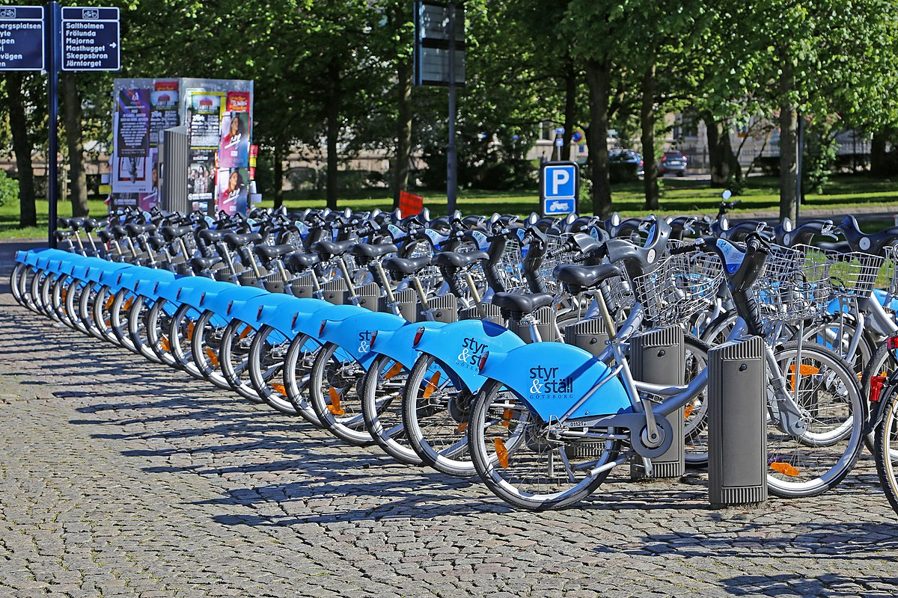
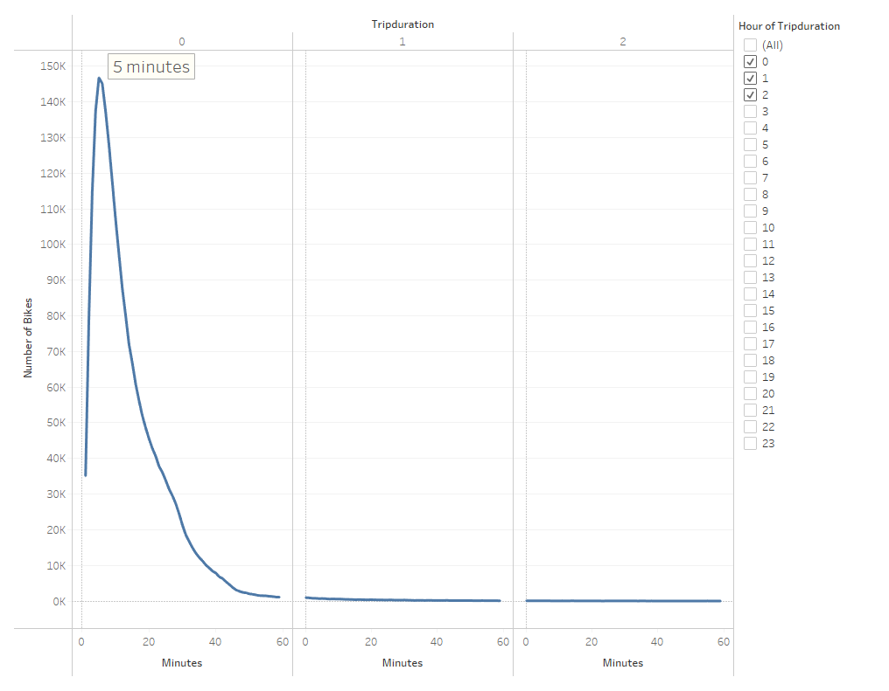
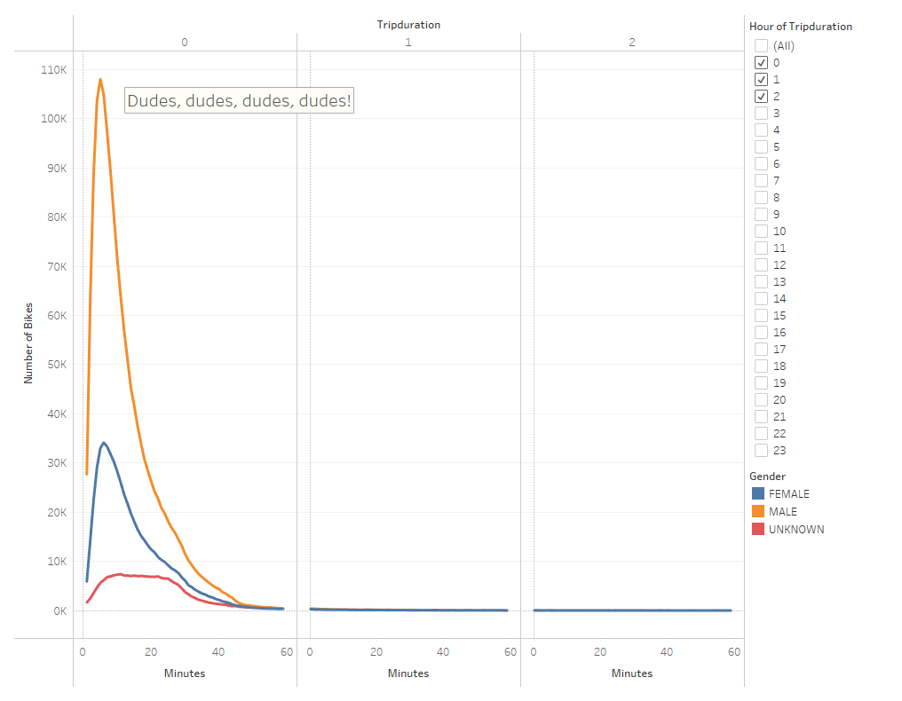
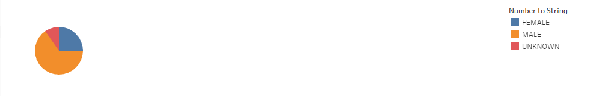
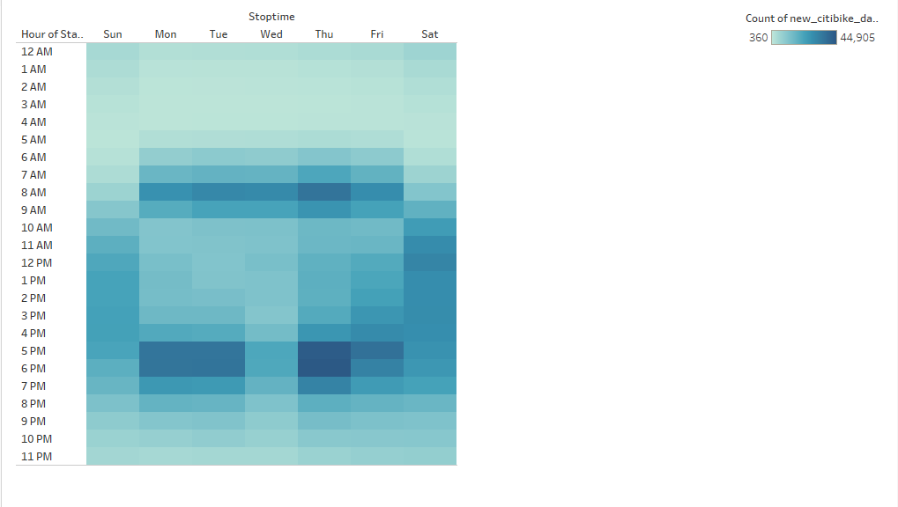
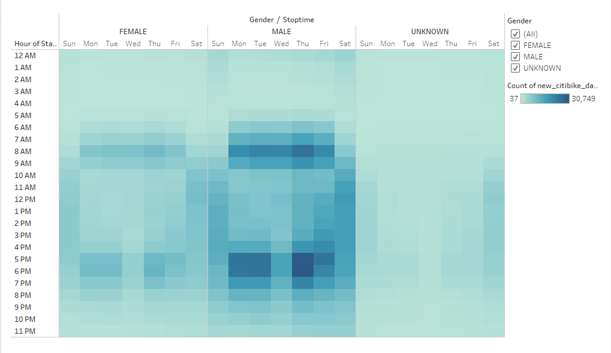
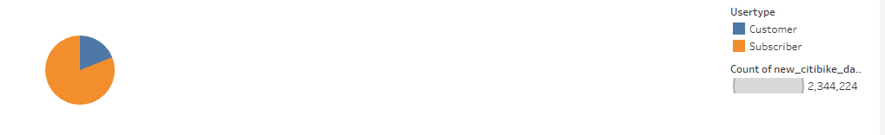
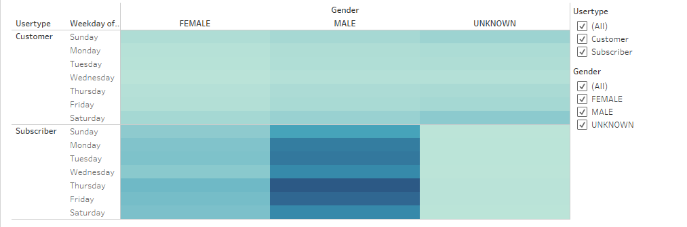

# bikes

Bike sharing has become more and more common to see in cities these days. This is a study on bike sharing data from New York City. The goal is to see if this concept is doable in Des Moines, Iowa!

A presentation on the data set can be found at the link below:

[link to dashboard](https://public.tableau.com/app/profile/jared.allerson/viz/Bike_Data_Challenge/Story1?publish=yes)

How long do people generally use these bikes? Most people just take short trips on these bikes. We can see that the most occurring checkout time is 5 minutes. We can speculate that riders just use the bikes to go a couple blocks to see tourist attractions or run errands. The lack of longer bike rides indicates that we won't need as many bikes readily available to customers since people return them so quickly.

What gender will use the bikes the most? Using the same concept from the previous slide, we can break down whether it's males or females that will use the bikes the most. A vast majority of both females and males just use the bikes for that 5-minute timeframe. However, we can see that there is a significant difference between usage rates of the genders. Males heavily outnumber females and will be our most frequent customer.

What is the actual ratio of male users verses female users? With the previous slide, we knew that males outnumbered females. Using a pie chart, we can visually see that males make up 65%. Meanwhile, females make up 25% of users. 10% of users are unknown genders, so we can only speculate.

When can we expect most customers to use the bikes? The darker sections indicate high usage levels. During the week, most customers use it around 8 AM in the morning or at 5 and 6 PM in the evening. On the weekend usage rates are more spread-out during the day.

Is there a difference between usage times of males and females? There are significantly more slightly shaded squares for the male’s section than there is for the females. We can expect to see male users still using the bikes late at night. Tt would be uncommon to see females riding late at night or during the middle of the day.

It's interesting to see that during the week there is a high level of usage at 8 AM in the morning and 5 PM in the evening. That time indicates to me that there's a high probability that the bikes are being used to commute to work. If that's the case, there's a good chance that these people are subscribers to the bike program and that they depend on the bikes to get to work. How many people are subscribers’ verses just customers? This pie chart shows that 81% of customers are subscribers!

Are males more likely to be subscribers and using the program to commute to work? The data indicates, yes! Monday through Friday have much higher usage rates for males during the week than on the weekend. Overall male subscribers are the main customer basis.

# Results:

Although New York City is significantly larger than Des Moines, the data is completely applicable given the results. Most bike sharing users in the data set were using the bikes to commute to work! In every large city, people avoid having to deal with traffic. Getting to work on time is a necessity and most bike commuters don't want to bring a bike into the office or risk getting a bike stolen. This study on bike sharing shows that most users are subscribers and depend on it. This will bring in consistent and reliable income if installed in Des Moines. The main customer bases is male subscribers, but other customers enjoy using the bikes at all times of the day and even on weekends. 

# Potential Improvements:
Changing the pie chart to a donut chart would be ideal. Pie charts are nice, but they can be hard to read sometimes. Donut charts give a better representation of the percentage differences between variables. Having a trip duration graph that shows the difference between subscribers and customers would give us insight into how long each of those types of users use the bikes. I would hypothesis that subscribers have a shorter trip duration. Meanwhile, customers are the ones that would be using the bikes to get around town and do sightseeing. Since subscribers are the main customer basis, I would advocate setting up bike rental/return stations around how far these customers tend to take the bikes.